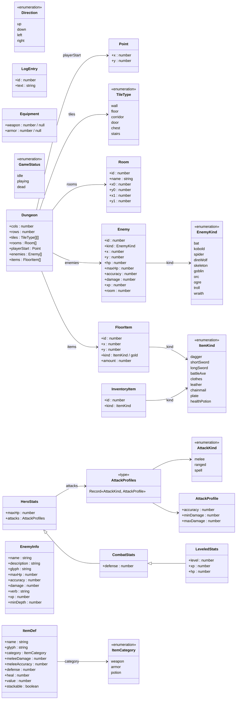
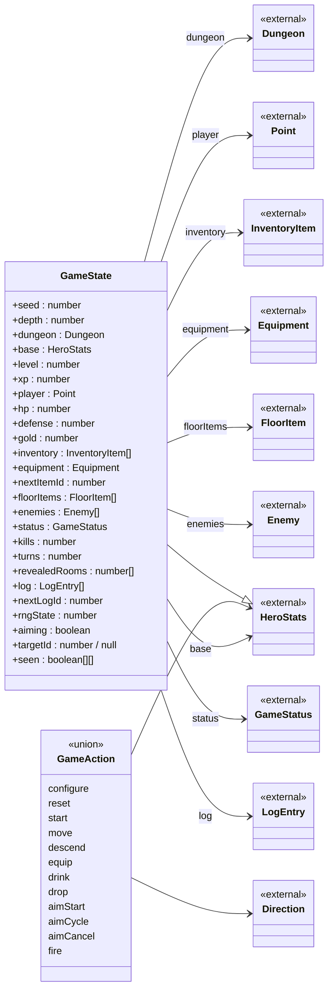
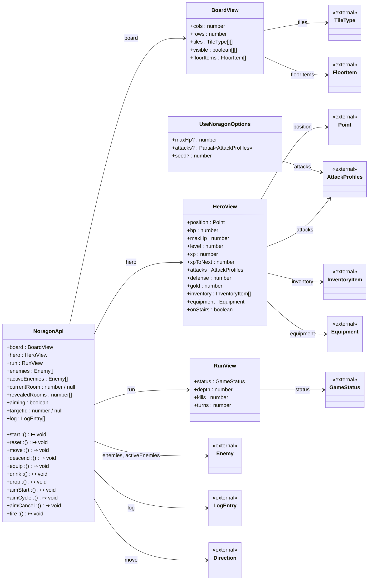
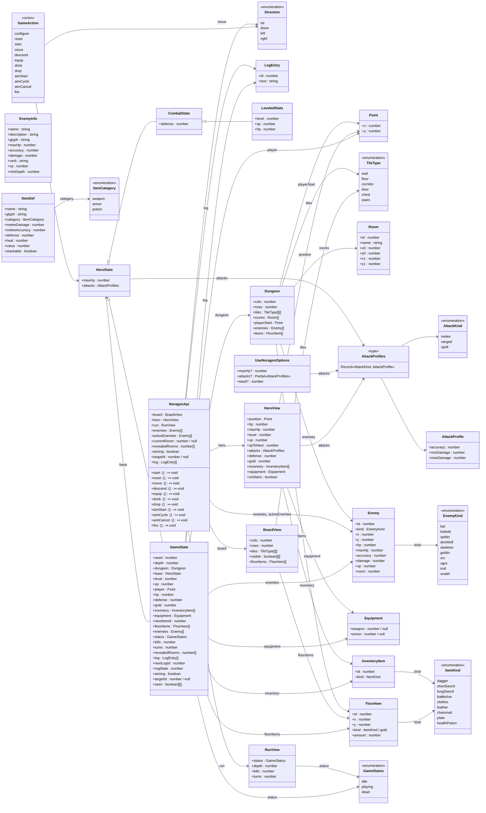

# Domain model

<!-- GENERATED FILE — do not edit by hand. Run `npm run docs:model` to regenerate.
     CI fails if the diagram text is out of date with the types. -->

> Auto-generated by `npm run docs:model` from `src/game/types.ts`, `src/game/enemies.ts`, `src/game/items.ts`.

This is every `interface` and `type` the game defines and how they connect, as
Mermaid class diagrams (rendered inline on GitHub). SVG renders of each are
produced by the CI **docs** job and uploaded as a downloadable build artifact;
run `npm run docs:render` to produce them locally under `docs/domain-model/`. In the
diagrams:

- **Hollow arrows** (`<|--`) are interface inheritance (`extends`).
- **Solid arrows** (`-->`) are associations — a field of one type whose value is
  (or contains) another declared type; the label is the field name(s).
- `<<enumeration>>` is a string-literal union, `<<union>>` a discriminated union
  (its members are the `type` tags), `<<type>>` a plain alias, and `<<external>>`
  a type that lives in another area (shown for context, defined in full there).

The types split into three areas — **domain** (the shared game world), **engine**
(the reducer's private state/action contract), and **public API** (what the
`useNoragon` hook takes and returns).

## Areas

### Domain

The shared game-world types: tiles, rooms, enemies, items, hero stats.

### Engine

The reducer's private contract — the whole game state and every action.

### Public API

What `useNoragon` takes and returns: options and the grouped view objects.

## Full model

Every type, fully connected.

## Index

| Type                | Kind      | Area   | Source                |
| ------------------- | --------- | ------ | --------------------- |
| `Point`             | interface | domain | `src/game/types.ts`   |
| `Direction`         | enum      | domain | `src/game/types.ts`   |
| `TileType`          | enum      | domain | `src/game/types.ts`   |
| `Room`              | interface | domain | `src/game/types.ts`   |
| `LogEntry`          | interface | domain | `src/game/types.ts`   |
| `InventoryItem`     | interface | domain | `src/game/types.ts`   |
| `FloorItem`         | interface | domain | `src/game/types.ts`   |
| `Equipment`         | interface | domain | `src/game/types.ts`   |
| `AttackKind`        | enum      | domain | `src/game/types.ts`   |
| `AttackProfile`     | interface | domain | `src/game/types.ts`   |
| `AttackProfiles`    | alias     | domain | `src/game/types.ts`   |
| `Enemy`             | interface | domain | `src/game/types.ts`   |
| `GameStatus`        | enum      | domain | `src/game/types.ts`   |
| `HeroStats`         | interface | domain | `src/game/types.ts`   |
| `CombatStats`       | interface | domain | `src/game/types.ts`   |
| `LeveledStats`      | interface | domain | `src/game/types.ts`   |
| `Dungeon`           | interface | domain | `src/game/types.ts`   |
| `UseNoragonOptions` | interface | public | `src/game/types.ts`   |
| `BoardView`         | interface | public | `src/game/types.ts`   |
| `HeroView`          | interface | public | `src/game/types.ts`   |
| `RunView`           | interface | public | `src/game/types.ts`   |
| `NoragonApi`        | interface | public | `src/game/types.ts`   |
| `GameState`         | interface | engine | `src/game/types.ts`   |
| `GameAction`        | union     | engine | `src/game/types.ts`   |
| `EnemyKind`         | enum      | domain | `src/game/enemies.ts` |
| `EnemyInfo`         | interface | domain | `src/game/enemies.ts` |
| `ItemCategory`      | enum      | domain | `src/game/items.ts`   |
| `ItemKind`          | enum      | domain | `src/game/items.ts`   |
| `ItemDef`           | interface | domain | `src/game/items.ts`   |
