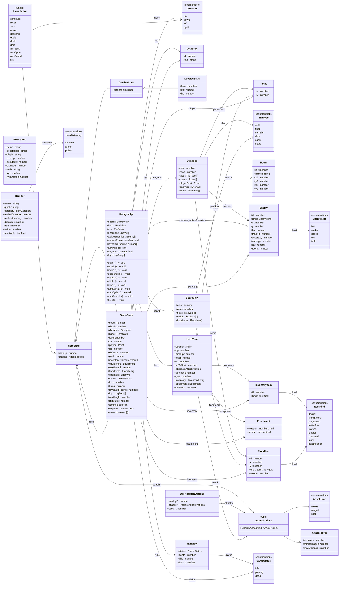

# Domain model

<!-- GENERATED FILE — do not edit by hand. Run `npm run docs:model` to regenerate.
     CI fails if this file is out of date with the types. -->

> Auto-generated by `npm run docs:model` from `src/game/types.ts`, `src/game/enemies.ts`, `src/game/items.ts`.

This is every `interface` and `type` the game defines and how they connect.
In the diagram:

- **Hollow arrows** (`<|--`) are interface inheritance (`extends`).
- **Solid arrows** (`-->`) are associations — a field of one type whose value is
  (or contains) another declared type; the label is the field name(s).
- `<<enumeration>>` is a string-literal union, `<<union>>` a discriminated union
  (its members are the `type` tags), and `<<type>>` a plain type alias.

## Index

| Type                | Kind      | Source                |
| ------------------- | --------- | --------------------- |
| `Point`             | interface | `src/game/types.ts`   |
| `Direction`         | enum      | `src/game/types.ts`   |
| `TileType`          | enum      | `src/game/types.ts`   |
| `Room`              | interface | `src/game/types.ts`   |
| `LogEntry`          | interface | `src/game/types.ts`   |
| `InventoryItem`     | interface | `src/game/types.ts`   |
| `FloorItem`         | interface | `src/game/types.ts`   |
| `Equipment`         | interface | `src/game/types.ts`   |
| `AttackKind`        | enum      | `src/game/types.ts`   |
| `AttackProfile`     | interface | `src/game/types.ts`   |
| `AttackProfiles`    | alias     | `src/game/types.ts`   |
| `Enemy`             | interface | `src/game/types.ts`   |
| `GameStatus`        | enum      | `src/game/types.ts`   |
| `HeroStats`         | interface | `src/game/types.ts`   |
| `CombatStats`       | interface | `src/game/types.ts`   |
| `LeveledStats`      | interface | `src/game/types.ts`   |
| `Dungeon`           | interface | `src/game/types.ts`   |
| `UseNoragonOptions` | interface | `src/game/types.ts`   |
| `BoardView`         | interface | `src/game/types.ts`   |
| `HeroView`          | interface | `src/game/types.ts`   |
| `RunView`           | interface | `src/game/types.ts`   |
| `NoragonApi`        | interface | `src/game/types.ts`   |
| `GameState`         | interface | `src/game/types.ts`   |
| `GameAction`        | union     | `src/game/types.ts`   |
| `EnemyKind`         | enum      | `src/game/enemies.ts` |
| `EnemyInfo`         | interface | `src/game/enemies.ts` |
| `ItemCategory`      | enum      | `src/game/items.ts`   |
| `ItemKind`          | enum      | `src/game/items.ts`   |
| `ItemDef`           | interface | `src/game/items.ts`   |
